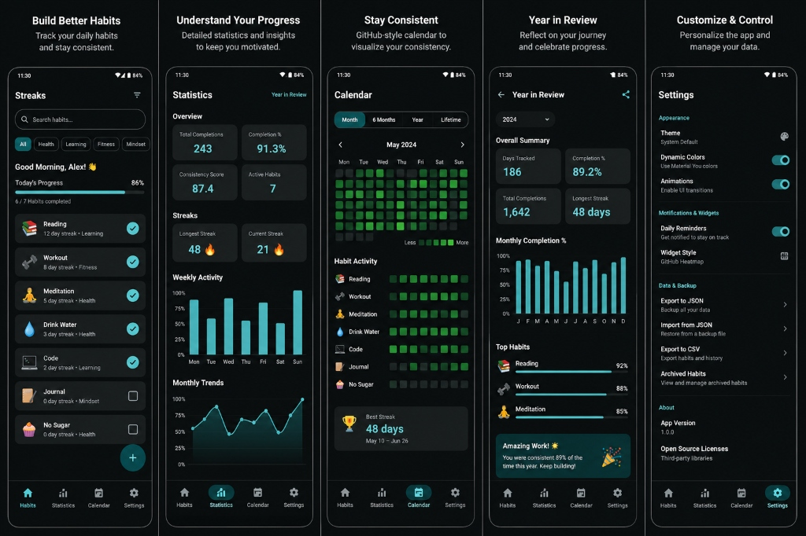
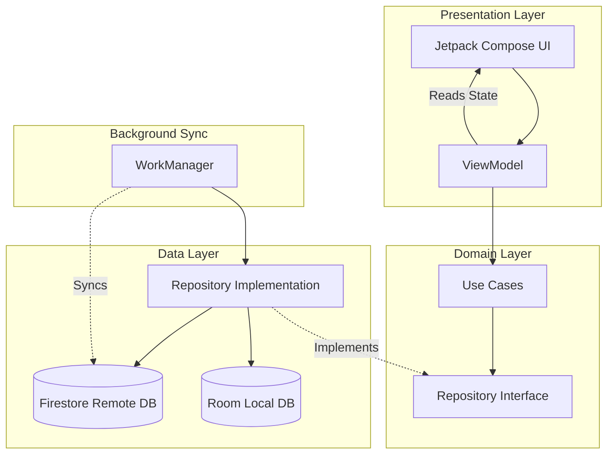

<div align="center">

# Streaks
A modern, offline-first habit tracking application built with Kotlin and Jetpack Compose.


</div>

---

## Overview

**Streaks** is a premium, offline-first habit tracker designed for maximum productivity and minimal friction. Built entirely with Jetpack Compose, the application emphasizes a clean, Material 3 aesthetic with dynamic colors and smooth micro-animations. 

The core philosophy behind Streaks is reliability and performance. By implementing a robust local-first architecture using Room database and a background synchronization strategy with Firestore, the app guarantees instantaneous UI interactions regardless of network conditions. Whether you are tracking daily routines, managing complex weekly goals, or reviewing long-term consistency, Streaks provides a responsive, engaging, and deeply analytical experience.

---

## Screenshots

<div align="center">
  
</div>

---

## Features

### Habit Management
* **Flexible Scheduling**: Support for Daily, Weekdays, Weekends, Weekly, Monthly, and custom interval habit frequencies.
* **Categories & Search**: Organize habits by customizable categories and filter them effortlessly.
* **Archiving**: Soft-delete functionality to preserve historical data without cluttering the main dashboard.

### Rich Analytics & Visualization
* **Advanced Statistics**: Comprehensive dashboards featuring completion percentages, consistency scores, and streak averages.
* **GitHub-Style Heatmap**: A dedicated calendar view utilizing a contribution graph to visualize long-term consistency.
* **Year In Review**: Generates a beautiful, shareable summary of annual achievements and category breakdowns.

### System Integration
* **Glance Widgets**: Lightweight, interactive home screen widgets for tracking and completing habits directly from the launcher.
* **WorkManager Notifications**: Reliable, scheduled local reminders configured per habit.
* **Material You**: Dynamic color theming that adapts to the user's system wallpaper and preferences.

### Data & Architecture
* **Offline-First Synchronization**: All reads/writes happen locally via Room, with WorkManager handling seamless background uploads to Firebase.
* **Data Backup**: Secure, authenticated cross-device synchronization via Firebase Authentication and Firestore.

---

## Architecture

Streaks is strictly engineered using **Clean Architecture** principles and the **Model-View-ViewModel (MVVM)** pattern. This ensures a high degree of separation of concerns, testability, and scalability.

Dependencies are managed using **Hilt (Dagger)** for robust inversion of control. State flows unidirectionally from the data layer up to the UI using Kotlin `StateFlow`.



---

## Tech Stack

| Layer | Technology |
|-------|------------|
| **Language** | Kotlin |
| **UI Toolkit** | Jetpack Compose, Material 3 |
| **Architecture** | MVVM + Clean Architecture |
| **Dependency Injection** | Hilt |
| **Local Database** | Room (SQLite) |
| **Cloud Infrastructure** | Firebase Authentication + Firestore |
| **Background Tasks** | WorkManager |
| **Widgets** | Jetpack Glance |
| **Preferences** | DataStore |
| **Visualizations** | Compose Canvas |
| **Build System** | Gradle (KTS) |

---

## Project Structure

The codebase is modularized by feature within a monolithic `app` module, strictly adhering to Clean Architecture layers:

```
app/src/main/java/com/example/streaks/
├── data/               # Local DB, Remote API, Mappers, Repositories Impl
├── domain/             # Models, Repository Interfaces, Use Cases
├── presentation/       # Composables, ViewModels, UI State
│   ├── home/
│   ├── stats/
│   ├── calendar/
│   ├── components/     # Reusable UI components
│   └── theme/          # Material 3 Theme definition
├── di/                 # Hilt Modules
├── widget/             # Glance AppWidget configurations
├── workers/            # WorkManager CoroutineWorkers
└── app/                # Application class
```

---

## Installation

1. **Clone the repository**
   ```bash
   git clone https://github.com/yourusername/streaks.git
   ```
2. **Open in Android Studio**
   Open the project using Android Studio (Iguana or newer recommended).
3. **Firebase Configuration**
   * Create a project in the [Firebase Console](https://console.firebase.google.com/).
   * Download the `google-services.json` file.
   * Place it in the `app/` directory.
   *(Note: The app will run without Firebase in a purely local offline mode if the Google Services plugin is conditionally bypassed, though features like cloud backup will be disabled).*
4. **Sync & Build**
   Sync project with Gradle files and click Run.

---

## Build Requirements

* **IDE**: Android Studio Iguana | 2023.2.1+
* **JDK**: Version 17
* **Minimum SDK**: 26 (Android 8.0)
* **Target SDK**: 34 (Android 14)
* **Kotlin Version**: 1.9.0+

---

## Key Engineering Highlights

<details>
<summary><strong>Offline-First Synchronization</strong></summary>
The app is designed to function 100% offline. `Room` acts as the single source of truth. The `StreaksRepository` implementation writes directly to Room, instantly updating the UI via `Flow`. A background `CoroutineWorker` is scheduled to push the changes to `Firestore` when network conditions are favorable, utilizing a "last-write-wins" or timestamp-based conflict resolution strategy.
</details>

<details>
<summary><strong>Complex Streak Calculation Algorithm</strong></summary>
The `CalculateStreakUseCase` is heavily unit-tested and parses dynamic habit frequencies (e.g., "Every Monday/Wednesday" or "Every 3 Days"). It mathematically computes `Periods` and validates sequence chains without breaking a user's streak for failing to complete a habit on an unscheduled rest day.
</details>

<details>
<summary><strong>Reactive UI with StateFlow</strong></summary>
State is hoisted to ViewModels and exposed as `StateFlow`. Composables observe these flows and recompose efficiently. The app avoids passing ViewModels down the composable tree, instead utilizing event callbacks (`onEvent`) to maintain pure, testable UI functions.
</details>

<details>
<summary><strong>Room Schema Migrations</strong></summary>
Proper SQLite migration scripts are maintained in `AppModule.kt` to ensure seamless upgrades (e.g., adding `frequency` or `isArchived` flags) without data loss for existing users.
</details>

---

## Performance

Streaks is optimized for a smooth 60+ FPS experience:
* **Lazy Loading**: Extensive use of `LazyColumn` and `LazyRow` ensures efficient memory usage when scrolling through long lists of historical completions.
* **Compose Optimization**: Modifier re-use, derived states (`derivedStateOf`), and stable data structures minimize unnecessary recompositions.
* **Efficient Queries**: Room DAO queries utilize `Flow` to only emit updates when underlying tables change, preventing constant UI polling.
* **Coroutines**: All I/O operations (Database, Network, DataStore) are dispatched to `Dispatchers.IO` to keep the main thread unblocked.

---

## Testing

The project includes a comprehensive testing suite ensuring business logic integrity.
* **Unit Tests**: Critical use cases (like `CalculateStreakUseCase` and `GetStatisticsUseCase`) are verified with JUnit.
* **ViewModel Tests**: State transitions and Kotlin flows are tested using the `Turbine` library.
* **Continuous Integration**: GitHub Actions `.github/workflows/android.yml` automatically runs `./gradlew lint` and `./gradlew testDebugUnitTest` on every pull request to `main`.

---

## Future Improvements

* **Wear OS Companion App**: A streamlined interface for checking off daily habits directly from a smartwatch.
* **Tablet & Foldable Optimization**: Utilizing adaptive layouts (e.g., `ListDetailPaneScaffold`) for larger screens.
* **Localization**: Full string externalization and support for multiple languages.
* **Accessibility Enhancements**: Improved `semantics` merging for screen readers and comprehensive TalkBack support.

---

## License

This project is licensed under the MIT License - see the [LICENSE](LICENSE) file for details.

---
